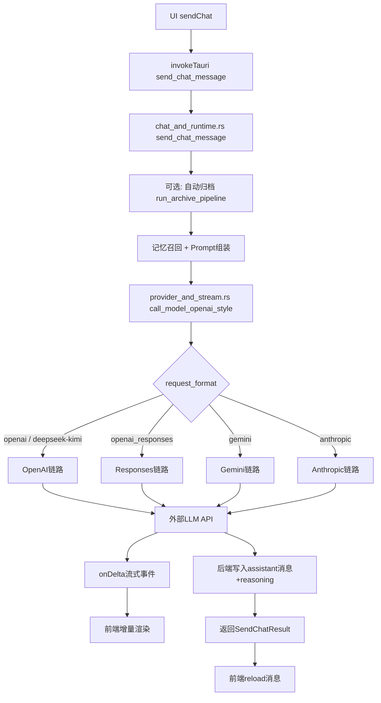
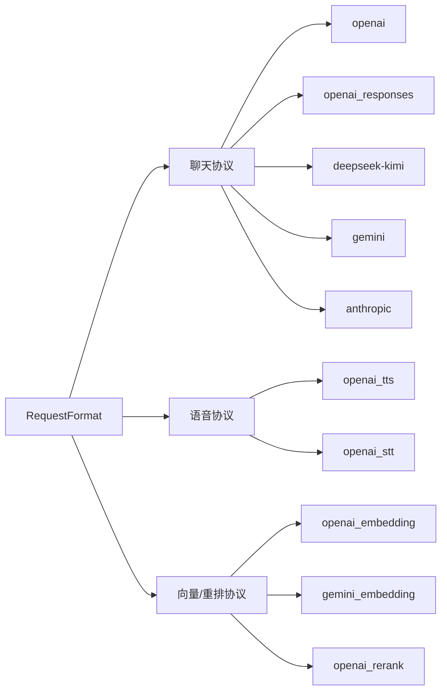

# 聊天消息链路全景（发送 -> 流式接收 -> 落库）

## 1. 主流程（文字版）

1. 前端 `useChatFlow.sendChat()` 发起请求，调用 `invokeTauri("send_chat_message")`，并创建 `onDelta` 通道接收流式事件。  
2. 后端 `send_chat_message` 进入统一入口，做会话与配置解析。  
3. 按需执行：自动归档、记忆召回、提示词组装（`PreparedPrompt`）。  
4. 进入统一聊天路由 `call_model_openai_style`。  
5. 根据 `RequestFormat` 分发到不同协议实现（OpenAI / OpenAI Responses / Gemini / Anthropic）。  
6. 模型流式输出通过 `onDelta` 回传前端（正文、reasoning、工具状态）。  
7. 模型结束后，后端把 assistant 消息与 provider_meta（reasoning）写入会话。  
8. 返回 `SendChatResult`，前端再 `reload messages` 对齐最终快照。

---

## 2. 关键入口与模块

### 前端
- `src/App.vue:1254` 调用 `invokeTauri("send_chat_message", ...)`
- `src/features/chat/composables/use-chat-flow.ts:157` 创建 `Channel`
- `src/features/chat/composables/use-chat-flow.ts:158` 处理 `deltaChannel.onmessage`

### 后端入口
- `src-tauri/src/features/system/commands/chat_and_runtime.rs:6` `send_chat_message`
- `src-tauri/src/features/system/commands/chat_and_runtime.rs:540` `stop_chat_message`

### 后端编排
- 自动归档：`chat_and_runtime.rs:272` `run_archive_pipeline(...)`
- 记忆召回：`chat_and_runtime.rs:356` `memory_recall_hit_ids(...)`
- 提示词组装：`chat_and_runtime.rs:410` `build_prepared_prompt_for_mode(...)`

### 聊天路由与协议执行
- 总路由：`src-tauri/src/features/chat/model_runtime/provider_and_stream.rs:1430` `call_model_openai_style(...)`
- OpenAI Responses 分支：`provider_and_stream.rs:1456`
- OpenAI / Responses rig 执行：`src-tauri/src/features/chat/model_runtime/tools_and_builtin.rs`

### 协议枚举
- `src-tauri/src/features/core/domain.rs:108` `enum RequestFormat`
- `src-tauri/src/features/core/domain.rs:183` `is_chat_text()`

---

## 3. 总流程图（Mermaid）



---

## 4. 协议分流图（Mermaid）



---

## 5. 纯文本备份图（无渲染环境可读）

```text
UI(sendChat)
  -> invokeTauri(send_chat_message)
    -> send_chat_message (后端入口)
      -> [可选] 自动归档
      -> 记忆召回
      -> 组装 PreparedPrompt
      -> call_model_openai_style (统一路由)
         -> 按 request_format 分发具体协议
         -> 调用外部 LLM API
         -> onDelta 流式回传
      -> 写入 assistant 消息/推理元信息
      -> 返回 SendChatResult
  -> 前端 reload messages 对齐最终状态
```

