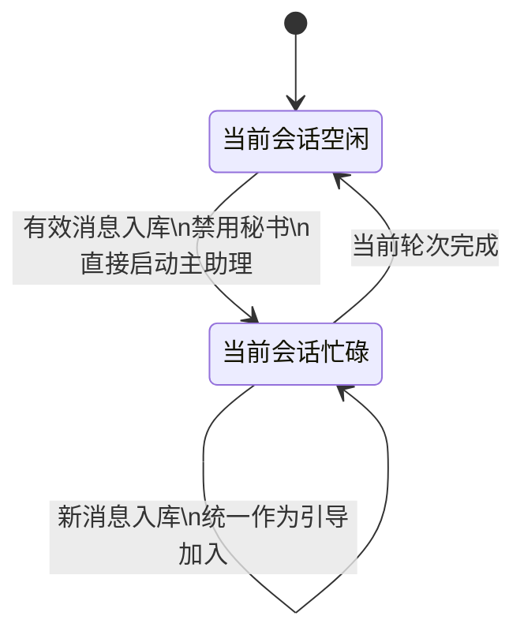
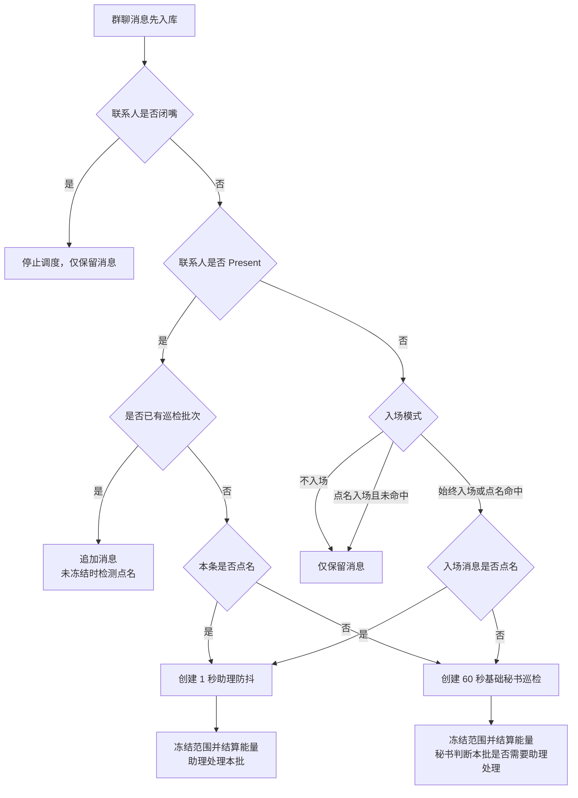
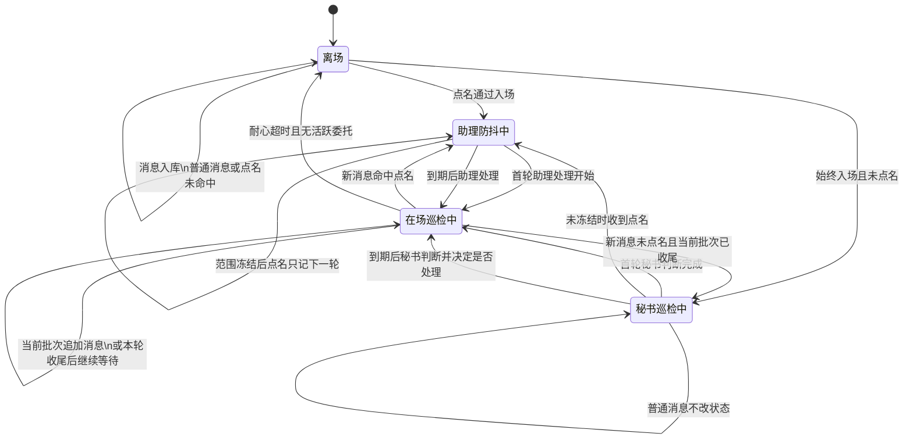

# 远程联系人状态机说明

本文使用业务语言说明当前远程联系人状态机。私聊和群聊采用不同处理模型，不能混为一套流程理解。

不同角色和委托实际获得的消息上下文，参见 [远程联系人上下文管理说明](remote_im_context_management.md)。

## 共同基础

无论私聊还是群聊，都遵守以下原则：

1. 远程消息先自然写入绑定会话。
2. 文字、图片、音频和附件都作为正式会话消息保存。
3. 联系人配置决定绑定人格、会话和耐心时间。
4. 私聊与群聊的区别发生在消息入库后的应答调度阶段。

群聊联系人使用以下参与状态：

- `离场`：助理没有主动参与当前联系人的对话。
- `在场`：助理正在参与或仍处于耐心等待期。

离场/在场只属于群聊。私聊不存在这两个状态，私聊只查看绑定会话当前是空闲还是忙碌。

---

# 一、私聊状态机

## 1. 私聊的核心模型

私聊禁用秘书，所有消息强制进入绑定会话的主助理调度：

```text
私聊消息入库
→ 不经过秘书判断
→ 当前会话空闲：直接启动主助理
→ 当前会话忙碌：作为引导消息加入当前会话
→ 发送给远程联系人
```

私聊不使用群聊的：

- 每群友助理防抖；
- 会话秘书防抖；
- 远程应答委托并发路由；
- `targetDelegateId` 引导选择。

私聊始终围绕一个明确联系人和一个绑定会话串行处理。

私聊消息不存在“秘书判断不回复”的分支。只要消息成功入库，就必须进入当前绑定会话的调度链路。

私聊不存在闭嘴词、张嘴词或闭嘴状态。用户正在直接和助理沟通，不需要群聊中的参与控制。

## 2. 私聊没有离场与在场

私聊不维护联系人离场/在场状态，也不执行耐心离场计时。

- 每条有效消息正常入库；
- 不调用秘书，也不等待群聊防抖；
- 不检查激活词、离场状态或耐心时间；
- 消息直接进入绑定会话调度。

私聊不使用“是否喊到名字”决定是否响应。私聊本身已经是用户对助理的直接沟通，所有有效消息都视为明确交给当前助理处理。

## 3. 私聊空闲与忙碌

私聊只根据绑定会话的调度状态处理：

- 当前会话空闲：直接启动新一轮；
- 当前会话正在运行：消息统一作为引导消息加入；
- 引导消息在当前轮的合法检查点接管后续处理，不经过秘书判断；
- 不会为同一私聊并发创建多个远程应答委托。

私聊的重点是保证当前绑定会话持续响应用户：用户在助理忙碌期间继续发送的内容不是普通等待消息，而是直接获得引导资格。

## 4. 私聊引导消息

私聊忙碌时，所有新消息都按引导消息处理。

引导消息表示：

- 用户正在补充、纠正或追加当前私聊请求；
- 当前主助理应在合法检查点尽快看到新内容；
- 不需要秘书评估是否值得插入；
- 不创建新的并发远程应答委托；
- 不丢弃当前已经完成的工作和工具结果。

私聊引导是当前绑定会话内部的连续调度，不是群聊中的委托路由。

## 5. 私聊状态图



---

# 二、群聊状态机

## 1. 群聊的核心模型

群聊不能把所有消息都直接交给助理，否则助理会介入与自己无关的话题。每条消息都先入库；`Away` 状态下只有通过入场判断的消息才会开始一次在场巡检。进入 `Present` 后，联系人已经在群里观察，后续消息属于持续巡检循环，不再重新要求命中点名词。

```text
Away + 消息入库
→ 始终入场：通过
→ 点名入场：命中点名词才通过
→ 不入场：不通过，仅保留消息

Present + 消息入库
→ 当前已有巡检批次：追加消息，保持原巡检等级
→ 当前没有巡检批次：创建下一次非点名巡检
→ 本条命中点名词：提升当前批次或下一批为点名巡检
```

未通过点名入场的消息只在 `Away` 状态下发生：它只保留在会话中，不创建秘书巡检、不调用模型。`Present` 是持续观察阶段，不是某个已完成批次的附属标签；批次收尾后，只要耐心时间尚未超时，下一条消息仍然进入下一次巡检。

助理防抖和秘书巡检不是同一种防抖，也不能使用同一条运行记录混合表示。

## 2. 当前 block 不变量

群聊 `Present` 期间，所有新消息都自然追加到当前 block 或下一次巡检范围；当前批次冻结后，新消息进入下一批，但仍属于同一段在场观察。

必须始终满足：

```text
当前摘要
→ 在场期间所有消息按原始顺序连续排列
→ 防抖结束锚点
```

绝对不允许：

- 把新消息插入旧 block；
- 按群友筛选正式上下文；
- 跳过锚点范围内的中间消息；
- 把未完成防抖的锚点移出当前 block；
- 从旧 block 拼接正式应答上下文。

群友 ID 只作为消息元数据，不用于过滤上下文或拆分同一入场批次。

## 3. 助理防抖

助理防抖用于“刚通过入场、且该入场消息明确喊到助理”的情况。

数量约束：

```text
每个联系人群聊最多一个已入场批次
批次起点由第一条入场消息固定；冻结前点名可升级巡检等级
```

处理规则：

1. 入场消息命中点名词时，创建 1 秒助理防抖。
2. 本批后续文字、图片、音频或附件只会追加到起点之后的持久化范围；范围冻结前的点名会升级为点名防抖并更新该等级的到期时间。
3. 范围冻结后，新消息不改写当前范围；点名只记录下一轮点名等级。
4. 起点到冻结边界的所有群友消息仍按原始顺序进入正式连续上下文。

助理防抖截止后：

- 没有运行中的远程应答委托：直接创建应答委托；
- 已有运行中的远程应答委托：由秘书选择新建委托或通过 `targetDelegateId` 引导已有委托；
- 明确喊到助理时必须回应，秘书不能选择不回答。

## 4. 秘书防抖

秘书巡检用于 `Present` 期间的非点名观察，也用于刚从 `Away` 通过入场但没有点名的首轮观察。它不是 `Away` 状态未入场消息的兜底入口：人没有入场，就没有工作台可巡检。

数量约束：

```text
每个联系人群聊永远最多一个秘书防抖
```

处理规则：

1. `Present` 期间没有活跃批次的新消息，或刚从 `Away` 通过但未点名的入场消息，创建一次以 60 秒为基础、带随机波动的秘书巡检。
2. 范围冻结前的普通消息不改变当前批次巡检等级，但仍可刷新 `Present` 的耐心时间；点名消息升级为点名巡检并按点名防抖重新排定到期时间。
3. 巡检到期后先冻结消息范围并结算本轮能量，再由秘书统一判断这段话题是否与助理有关。
4. 范围冻结后的新消息不改写当前批次，只记录下一轮点名等级。秘书可以选择：
   - 不回复；
   - 创建新的远程应答委托；
   - 通过 `targetDelegateId` 引导已有委托。

普通秘书巡检一旦建立，即使联系人随后离场，仍会完成已经安排的本次判断。

秘书提示词必须固定分层：

- 系统提示词只放秘书角色、固定判断规则、路由约束和 JSON 输出协议；
- 第一个用户提示词放联系人、人格、历史消息、本次防抖消息、助理工作账本、活跃委托和审查模式等动态上下文。

普通审查和忙碌路由都必须使用同一分层。具体字段和示例参见 [远程联系人上下文管理说明](remote_im_context_management.md#1-秘书提示词的固定分层)。

## 5. 助理防抖与秘书巡检的互斥

同一联系人不能同时保留待执行的助理防抖和秘书防抖。

同一联系人同一时刻只有一个已入场批次，但 `Present` 状态独立于批次生命周期。入场消息决定首轮巡检等级；范围冻结前点名可以把非点名巡检升级为助理防抖，`Present` 期间批次收尾后的普通消息可以创建下一次非点名巡检。冻结后的点名只记录下一轮等级。

## 6. 防抖只观察已入库消息

消息处理顺序固定为：

```text
消息成功写入当前 block
→ 防抖观察器收到稳定消息 ID
→ 更新已有防抖或创建新防抖
```

防抖不拥有、不消费、不移动消息，也不保存消息正文。它只保存：

- 联系人 ID；
- 起点消息 ID；
- 到期后冻结的结束锚点消息 ID；
- 版本令牌；
- 本轮能量是否已经结算的内存标记；

重新排定巡检时会替换版本令牌。旧定时任务醒来后发现令牌已变化，直接退出。

## 7. 防抖截止后的消息读取

### 助理防抖

没有运行应答委托时，防抖层按到期时冻结的 `decision_end_message_id` 读取目标范围，然后创建应答委托。

应答委托继续使用正式上下文链路：

```text
当前摘要
→ 当前 block 内全部连续消息
→ decision_end_message_id
```

防抖层不提前整读当前 block。

### 秘书防抖

秘书只需要：

- 防抖起点之前最近的有限历史；
- 防抖起点到结束锚点的连续消息。

秘书判断不等于助理正式上下文。秘书决定需要回答后，应答委托仍通过正式上下文链路读取当前摘要到结束锚点的完整连续内容。

## 8. 远程应答委托

群聊正式回复由独立的远程应答委托执行。

每个委托拥有：

- 唯一委托 ID；
- 触发消息锚点；
- 负责绑定人格；
- 冻结到触发锚点的正式上下文；
- 运行状态和结果。

同一联系人可以存在多个并发应答委托。秘书通过助理工作账本查看当前工作，并使用 `targetDelegateId` 把后续内容引导到正确委托。

## 9. 助理工作账本

助理工作账本由正式委托记录和委托会话统一生成，不从聊天文本临时猜测。

账本包含：

- 委托 ID；
- 工作状态：运行中、已完成、失败；
- 触发任务摘要；
- 实际回复摘要或失败原因；
- 开始和结束时间。

账本供以下链路共用：

- 秘书回复判断；
- 忙碌时的新建或引导选择；
- 新应答委托的系统提醒；
- 群聊离场反思。

## 10. 群聊离场

成功应答后，联系人保持在场并重新计算耐心时间。之后每次状态机确认继续保持 `Present`，都必须同时更新 `last_presence_at` 并刷新耐心计时器；只写 `presence_state = Present` 而不刷新计时器是不完整的状态转换。

`Present` 期间按秘书巡检周期持续观察群消息；一轮收尾后，新消息进入下一轮，而不是重新经过 `activation_mode`。耐心时间结束且没有活跃应答委托时：

1. 联系人转为离场；
2. 启动离场反思委托；
3. 反思读取当前会话上下文和助理工作账本；
4. 只应用反思结果中的记忆操作。

离场后：

- 未喊到助理的消息只入库；
- 喊到助理的消息重新触发 1 秒助理防抖和入场处理。

## 11. 闭嘴状态

闭嘴和张嘴只属于群聊状态机，私聊不支持也不使用这套机制。

命中闭嘴词后：

- 联系人进入闭嘴期；
- 清除该联系人所有待执行助理防抖；
- 清除该联系人唯一秘书防抖；
- 中止该联系人所有仍在运行的远程应答委托；
- 不启动新的防抖；
- 定时任务真正触发时再次检查闭嘴；
- 创建或引导应答委托前再次检查闭嘴；
- 自动发送与所有真正外发路径在转发前再次检查闭嘴。

因此：

- 闭嘴期间已经存在的旧定时任务也不能产生回复；
- 闭嘴前已在途的应答，能打断就立刻打断；
- 即便生成已经完成，真正转发到远程前也必须被拦截。

命中张嘴词或闭嘴时间到期后，联系人恢复正常消息观察。

## 12. 群聊总览图



## 13. 群聊状态图



---

# 三、私聊与群聊对照

| 维度 | 私聊 | 群聊 |
|---|---|---|
| 正式执行者 | 绑定会话主助理 | 独立远程应答委托 |
| 秘书 | 完全禁用 | 仅处理已入场的非点名批次，基础巡检周期为 60 秒 |
| 闭嘴/张嘴 | 不存在 | 支持群聊闭嘴期及多阶段调度拦截 |
| 调度方式 | 所有有效消息强制进入当前绑定会话 | 防抖 + 秘书路由 + 可并发委托 |
| 点名处理 | 私聊不区分点名，消息天然直达助理 | 点名入场时作为本批 1 秒助理防抖 |
| 未点名处理 | 仍然直接调度当前会话 | `Away` 时只有始终入场模式可启动首轮巡检；`Present` 期间普通消息继续进入 60 秒基础秘书巡检，未入场消息只保存 |
| 忙碌中新消息 | 统一作为当前会话引导消息加入 | 秘书选择新建或引导已有委托 |
| 正式上下文 | 绑定会话连续上下文 | 当前摘要到触发锚点的当前 block 连续上下文 |
| 离场/在场 | 不存在 | 存在，耐心超时且无活跃委托后离场并反思 |

## 一句话总结

私聊没有秘书、闭嘴/张嘴和离场/在场，所有有效消息先入库再调度当前绑定会话，忙碌时只把消息 ID 作为引导引用加入；群聊则先把消息写入当前 block，`Away` 时由入场模式决定是否进入 `Present`，`Present` 期间循环按点名助理防抖或非点名秘书巡检观察，范围冻结前点名可升级，批次收尾后普通消息进入下一轮，耐心超时才回到 `Away`。
